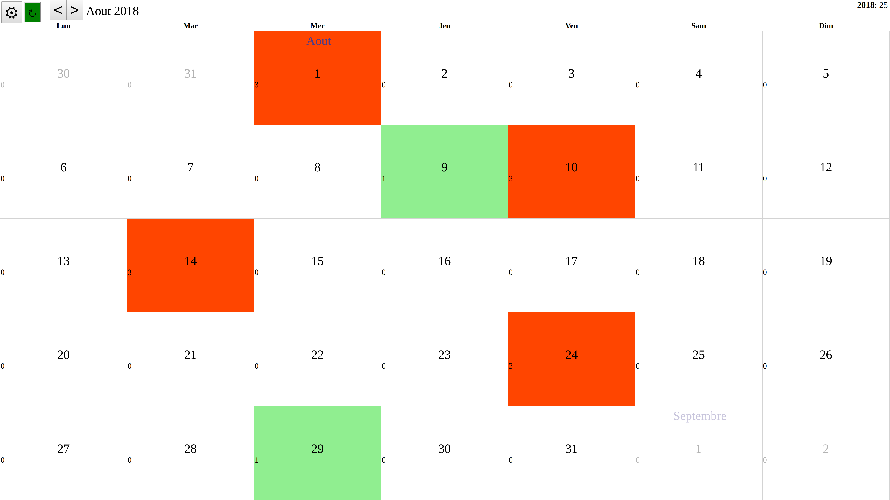

This is a small calendar application to count my wife (half-)day of work.

Each day can contain up to four half-day of work (yes, that's weird).

Persistance of the calendar is ensured through webstorage, the file is synced to google drive.

## OAuth sync

modify `frontend/src/MyOAuthConfig.hs` file with `clientID` and
`clientSecret` from your OAuth application.

## JSaddle work (fast iterations)

```shell
nix-shell -A shells.ghc8_2_1
cd ./frontend

cabal new-repl
>>> go
```

- Open your browser to "http://localhost:3003"

## Android application

```shell
nix-build -A android.frontend
```

You will get your APK inside `result`.

# screenshot


